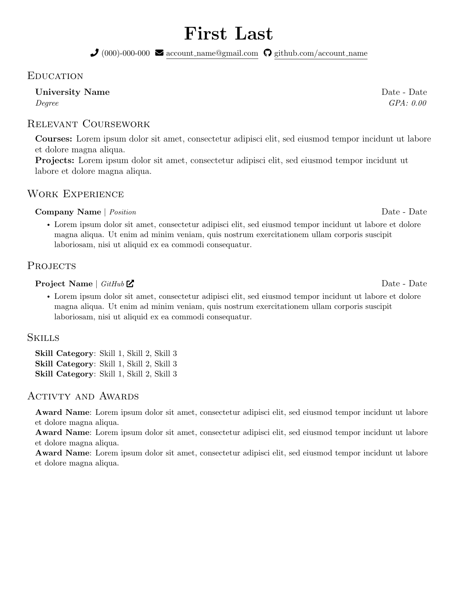

# Resume Template

Based on [mattyHerzig/mattys_resume](https://github.com/mattyHerzig/mattys_resume/tree/main)

### Resume Template Preview


### How to Use
Requires a LaTeX installation or [Overleaf](https://www.overleaf.com/). 

If you don't want to use Overleaf, I'd recommend using Docker with VS Code because it's easy to set up. I believe the steps below cover all requirements but please let me know if I missed something.

#### To create a public repository
* Fork repository on GitHub Website

#### To create a private repository
* Download a ZIP file of the code under `<> Code` on the GitHub website
* Create a new private repository
* Follow instructions below to create container for private repository
* Unzip ZIP file and copy contents to container

#### To set up Docker container
* Install Docker: <https://docs.docker.com/get-docker/>
* Install Docker extension in VS Code: <https://marketplace.visualstudio.com/items?itemName=ms-azuretools.vscode-docker>
* Install Remote Development extension in VS Code: <https://marketplace.visualstudio.com/items?itemName=ms-vscode-remote.vscode-remote-extensionpack>
* In VS Code -> Search/Select `>Dev Containers: Clone Repository in Container Volume...` -> Select `Clone a repository from GitHub in a Container Volume`
* You may be required to sign into GitHub with VS Code.
* Select repository
* Exit Search/Prompt

Renaming `first_last_resume.tex` will build the project. A bunch of files will be created including a PDF.

Editing the .tex file will also update the PDF, making it easy to work with.

#### To update the repository:

If you're using a public repository, be careful about sharing personal information.

```
git add .

git commit -m "update resume-template"

git push
```

If you're having problems with authentication this may be helpful: <https://code.visualstudio.com/docs/sourcecontrol/github>

#### To generate a PNG for a one-page resume
```
pdftoppm ./src/input_file_name.pdf output_file_name -png -singlefile
```
